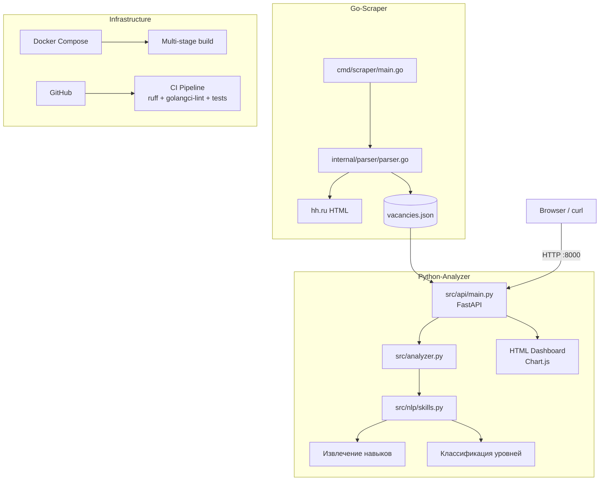
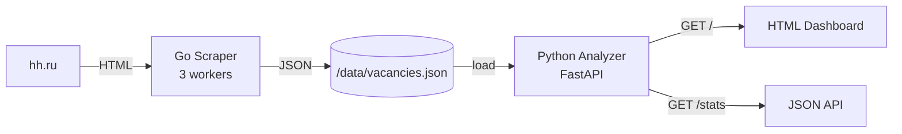

# HH.ru Intelligent Vacancy Parser

Интеллектуальный парсинг вакансий с hh.ru: **Go-сборщик** (HTML-парсинг) + **Python-аналитик** (NLP, FastAPI REST API).

Курсовая работа, вариант 21.

## Архитектура



**Data flow:**



## Структура проекта

```
.
├── go-scraper/                    # Go-сборщик (HTML-парсинг hh.ru)
│   ├── cmd/scraper/main.go        # Точка входа (флаги: -q, -areas, -period, -pages, -o)
│   └── internal/
│       ├── parser/parser.go       # Парсер hh.ru (goquery, 3 workers)
│       ├── parser/parser_test.go  # Тесты парсера
│       └── models/vacancy.go      # Модель вакансии
├── python-analyzer/               # Python-аналитик
│   ├── src/
│   │   ├── api/main.py           # FastAPI сервер + веб-интерфейс
│   │   ├── analyzer.py           # Сводная аналитика
│   │   ├── models.py             # Pydantic модель
│   │   └── nlp/skills.py         # Извлечение навыков, классификация уровней
│   └── tests/test_all.py         # Тесты pytest
├── data/                          # JSON-файлы вакансий (shared volume)
├── Dockerfile                     # Мультистейдж: Go build → Python runtime
├── docker-compose.yml             # docker compose up --build
├── .dockerignore
├── docs/                          # Документация
└── README.md
```

## Быстрый старт

### 1. Go-сборщик

```bash
cd go-scraper
go run ./cmd/scraper -q "Golang" -areas "1,2,92" -period 7 -pages 1 -o ../data/vacancies.json
```

Флаги:
- `-q` — поисковый запрос (по умолч. "Python")
- `-areas` — регионы через запятую: 1=Москва, 2=СПб, 3=Екатеринбург, 4=Новосибирск, 53=Краснодар, 88=Казань, 92=Тула
- `-period` — период в днях (по умолч. 30, 0 = все)
- `-pages` — страниц для сбора (0 = все доступные)
- `-o` — куда сохранить JSON (по умолч. data/vacancies.json)

### 2. Python-аналитик

```bash
cd python-analyzer
pip install -r requirements.txt
uvicorn src.api.main:app --reload
```

Эндпоинты:
- `GET /` — веб-дашборд (HTML)
- `POST /scrape` — запустить парсинг и получить аналитику
- `GET /analyze` — аналитика по загруженным данным (HTML)
- `POST /analyze` — загрузить JSON с вакансиями
- `GET /stats` — полная статистика (JSON)
- `GET /skills/top?limit=30` — топ навыков (JSON)
- `GET /skills/by-area` — навыки по городам (JSON)
- `GET /levels/distribution` — распределение по уровням (JSON)
- `GET /areas` — распределение по городам (JSON)
- `GET /salary` — зарплатная статистика (JSON)
- `GET /docs` — Swagger UI

### 3. Docker

```bash
docker compose up --build
```

Собирает Go-бинарник + Python-образ в одном мультистейдж `Dockerfile`, запускает сервер на `http://localhost:8000`.  
При POST /scrape Python вызывает встроенный Go-бинарник (не `go run`), данные сохраняются в `data/` через shared volume.

## Пример работы

```bash
# Сбор Golang-вакансий в Москве и СПб за 7 дней
go run ./go-scraper/cmd/scraper -q "Golang" -areas "1,2" -period 7 -pages 1

# Анализ
curl -s http://localhost:8000/skills/top?limit=10
# {"skills":[["go",17],["sql",12],["postgresql",11]...], "total_vacancies": 17}
```

## Тестирование

```bash
# Go
cd go-scraper && go test ./internal/... -v

# Python
cd python-analyzer && pytest tests/ -v
```

## Технологии

- **Go 1.26** — goquery (HTML-парсинг), конкурентный сбор (3 workers), rate-limited
- **Python 3.12** — FastAPI, Pydantic, Pandas
- **NLP** — извлечение навыков (60+ keywords), классификация junior/middle/senior
- **Docker** — Docker Compose, multi-stage build
- **Git** — semantic commits, Git flow
- **CI/CD** — GitHub Actions (ruff SAST, golangci-lint, pip-audit, tests)

## Как это работает

Сборщик использует **HTML-парсинг** `https://hh.ru/search/vacancy` (без OAuth2, без регистрации приложения):
1. Парсит страницу поиска — извлекает URL, названия, компании
2. Конкурентно (3 workers) обходит каждую вакансию — достаёт описание, навыки, зарплату, дату
3. Сохраняет в JSON

Аналитик:
1. Извлекает навыки из описания (keyword matching)
2. Классифицирует уровень (junior/middle/senior) по опыту и названию
3. Считает статистику по зарплатам, городам, навыкам
